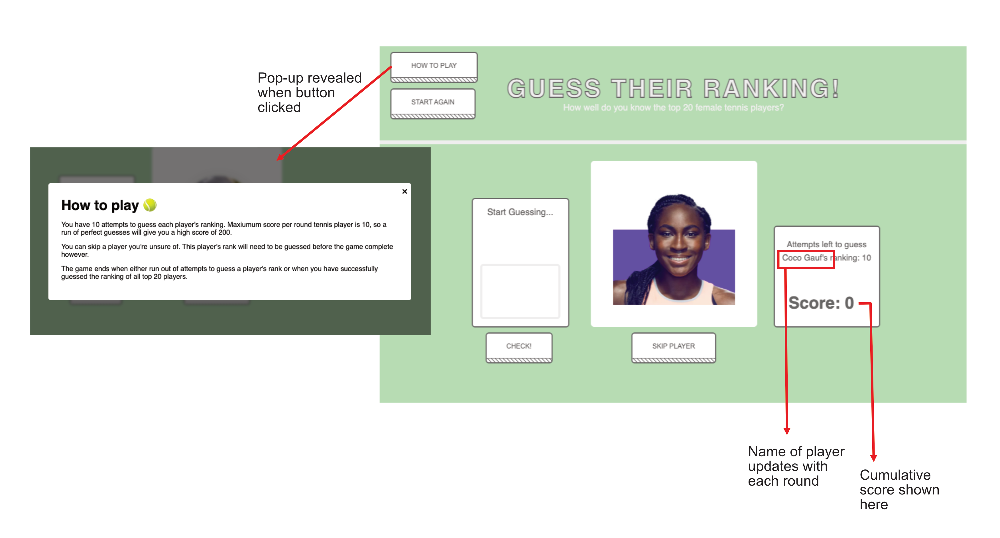
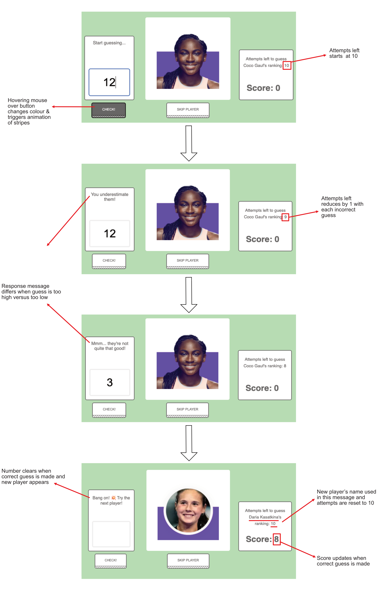

# Tennis-Ranking-Game 🎾

A game where a user must successfully guess the rank of all top 20 female tennis players.

## Table of contents

-  🤷🏼‍♀️ [How to Play](#how-to)
-  📸 [Demo](#demo) 
-  💪🏻 [Motivation](#motivation) 
-  💻 [Technologies](#technologies) 
-  🛠️ [Setup](#setup) 

<a name="how-to"></a>
## How to Play

A user types their guess into the box.
When the user makes a correct guess, the next top 20 player is (randomly) generated. This continues until all 20 players have been correctly guessed.

A player has 10 chances to guess the ranking of each tennis player, if they fail to succeed in this time, the game ends prematurely.

Players are generated one at a time but if a user is stuck, they can temporarily skip a player and return to them later.

### Scoring

A user can score a maximum of 10 points per player. With each additional guess they have to make, their point earning potential reduces by 1.
The maximum score for a completed game is 200 (10 points for each of the 20 players). The minimum score for a completed game is 20 (1 point for each of the 20 players).

<a name="demo"></a>
## Demo

<p align="center">

</p>

<p align="center">

</p>

<a name="motivation"></a>
## Motivation

I built this game as a way of solidifying the my learning and understanding of Javascript, HTML and CSS. Along the way I learned to use SASS to add a bit more interest to the page design. The game has a lot of scope for further development - see future improvements.

<a name="technologies"></a>
## Technologies

Built using:
* Javascript
* HTML
* CSS
* SASS (to manage CSS stylesheets)

## Future improvements / additions

<p>Add an animation to the project - curious to know if I can make a ball bounce across the screen!</p>
<p>Connect the project to an API of live rankings list so that the players rankings are always up to date.</p>
<p>Introduce the option to guess the rankings of the male tennis players too. </p>

<a name="setup"></a>
## Setup

### To run this project :

Clone this repository

```
$ git clone https://github.com/leah-massey/Tennis-Ranking-Game.git
```


Check that you have Ruby installed (if not installed, follow link to install: ["https://www.ruby-lang.org/en/documentation/installation/"])

```
$ ruby --version
```


Install SASS

```
gem install sass
```


Verify SASS installation 
```
sass --version
```


Finally:

```
Open the 'index.html' file in your web browser of choice.
```
